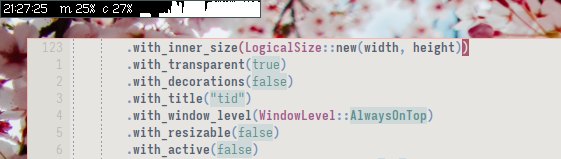

# _tid_ &mdash; a small system information bar



This little program is _slightly_ under construction. 
It is intended for my personal use, but by now it is polished enough that it may be useful to others as well.
Further improvements will come, especially based on problems from users beyond myself.
I am enjoying it a lot and it fits my needs.

(See also, accompanying [labbook entry](https://dwangschematiek.nl/labbook/tid/).)

## installation

```
git clone https://git.sr.ht/~ma3ke/tid
cd tid
cargo install --path .
sudo mkdir /etc/tid
sudo cp -r fonts /etc/tid/fonts
sudo cp tid.config /etc/tid
```

(I may put these operations into a makefile or shell script at some point, but it's quite trivial.)

## what it does

- Displays the date and time.
- Can display the battery percentage.
- Displays the memory usage as a percentage.
- Displays the cpu usage as a percentage.
- Displays the cpu usage history as a graph.
- Can show the current playback state of `mpd`.

## usage & configuration

_tid_ can be configured through a `/etc/tid/tid.config` file and command line arguments.

### config file

The config file must (as of now) be located at `/etc/tid/tid.config`.
An [example file](/tid.config) is provided in the repository.

Any of the following keywords are recognized, followed by some form of whitespace and an appropriate argument.
Each setting is on a separate line.
The arguments are interpreted in the same manner as the command line arguments.

- `font_name`
- `font_path`
- `foreground`
- `background`
- `mpd_addr`

Whitespace may precede or trail the lines.
Any part of a line beyond `#` is a comment and is ignored.

### command line arguments

- **Want to change the font?** 
  Fonts can be specified through command line arguments. Use, for example, `--font-name geneva12.uf2` or `--font-path /etc/tid/fonts/geneva12.uf2`.
  Currently, the supported font formats are [uf2](https://wiki.xxiivv.com/site/ufx_format.html) and [psf2](https://en.wikipedia.org/wiki/PC_Screen_Font). 
  For instance, [here](https://hachyderm.io/@ma3ke/111376077963594124) you can see _tid_ running with the beautiful `sun12x22.psfu` font.
  Note that uf2 fonts require a `.uf2` extension to be accepted, while `psf2` can be recognized through its magic number.
- **Want to change the color?** 
  You can set the foreground and background color by providing a `0x{r}{g}{b}{a}` formatted hex string as parameters after the `--fg` and `--bg` flags, respectively.
  For example, 

  ```
  tid --fg 0xcc33aaff --bg 0xffffff00
  ```

  will set the foreground to a dark magenta and the background to white transparent, like [this](https://hachyderm.io/@ma3ke/111377402365783978).
  By default, the background is black and transparent (if supported), and the foreground white.
- **Want to change the order and selection of items?**
  There is no nice way to do this at this moment, beyond changing the source code.
  For anybody who is somewhat familiar with editing source in any language, configuring this may be an interesting little challenge or more likely very easy.
  Nonetheless, it is pretty likely that I will add some mechanism to do this in the future. The first stones have been placed now that there is a config file system.

### full usage information

```
Usage:
    tid [OPTIONS]

Options:
    --font-name -n    Set the font name from the default directory.
                      (default: 'cream12.uf2' in '/etc/tid/fonts')
    --font-path -p    Set the font path.
    --fg              Specify the foreground color as an rgba hex string.
                      (default: 0xffffffff)
    --bg              Specify the background color as an rgba hex string.
                      (default: 0x00000000)
    --mpd-address     Specify the address for the mpd connection.
                      (default: 127.0.0.1:6600)
    --version   -v    Display function.
    --help      -h    Display help.
```

## weirdness


---

Thanks &lt;3 [ma3ke](https://dwangschematiek.nl)
