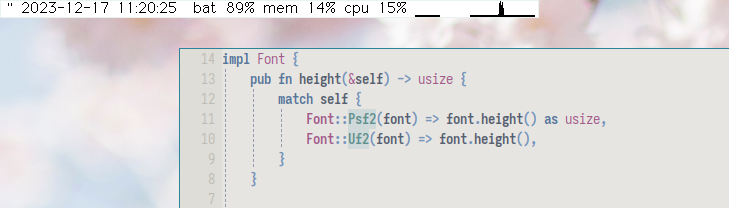

# _tid_ &mdash; a small system information bar



This little program is _slightly_ under construction. 
It is intended for my personal use, but by now it is polished enough that it may be useful to others as well.
Further improvements will come, especially based on problems from users beyond myself.
I am enjoying it a lot and it fits my needs.

(See also, accompanying [labbook entry](https://dwangschematiek.nl/labbook/tid/).)

## installation

```
git clone https://git.sr.ht/~ma3ke/tid
cd tid
cargo install --path .
sudo mkdir /etc/tid
sudo cp -r fonts /etc/tid/fonts
sudo cp tid.config /etc/tid
```

(I may put these operations into a makefile or shell script at some point, but it's quite trivial.)

## what it does

- Displays the date and time.
- Can display the battery percentage.
- Displays the memory usage as a percentage.
- Displays the cpu usage as a percentage.
- Displays the cpu usage history as a graph.
- Can show the current playback state of `mpd`.

## usage & configuration

_tid_ can be configured through a `/etc/tid/tid.config` file and command line arguments.

### config file

The config file must (as of now) be located at `/etc/tid/tid.config`.
An [example file](/tid.config) is provided in the repository.

Any of the following keywords are recognized, followed by some form of whitespace and an appropriate argument.
Each setting is on a separate line.
The arguments are interpreted in the same manner as the command line arguments.

- `elements`
- `font_name`
- `font_path`
- `foreground`
- `background`
- `mpd_addr`

Whitespace may precede or trail the lines.
Any part of a line beyond `#` is a comment and is ignored.

### command line arguments

- **Want to change the font?** 
  Fonts can be specified through command line arguments. Use, for example, `--font-name geneva12.uf2` or `--font-path /etc/tid/fonts/geneva12.uf2`.
  Currently, the supported font formats are [uf2](https://wiki.xxiivv.com/site/ufx_format.html) and [psf2](https://en.wikipedia.org/wiki/PC_Screen_Font). 
  For instance, [here](https://hachyderm.io/@ma3ke/111376077963594124) you can see _tid_ running with the beautiful `sun12x22.psfu` font.
  Note that uf2 fonts require a `.uf2` extension to be accepted, while `psf2` can be recognized through its magic number.
- **Want to change the color?** 
  You can set the foreground and background color by providing a `0x{r}{g}{b}{a}` formatted hex string as parameters after the `--fg` and `--bg` flags, respectively.
  For example,

  ```
  tid --fg 0xcc33aaff --bg 0xffffff00
  ```

  will set the foreground to a dark magenta and the background to white transparent, like [this](https://hachyderm.io/@ma3ke/111377402365783978).
  By default, the background is black and transparent (if supported), and the foreground white.
- **Want to change the order and selection of elements?**
  You can :)
  The elements can be specified through the command line arguments, or through the config file.
  The format for the elements specification string is a space delimited list of any of the following items:

  - _padding(`<width>`)_
  - _space_
  - _date_
  - _time_
  - _label(`<text>`)_
  - _battery_
  - _mem_
  - _cpu_
  - _cpugraph(`<width>`)_
  - _playbackstate_

  For an example, check the line in the [`config.tid`](/tid.config) file.

### full usage information

```
Usage:
    tid [OPTIONS]

Options:
    --elements        Define the elements to be displayed.
                      This is a space-delimited list of any of the following
                      items:
                        - padding(<width>)       - space
                        - date                   - time
                        - label(<text>)          - battery
                        - mem                    - cpu
                        - cpugraph(<width>)      - playbackstate
    --font-name -n    Set the font name from the default directory.
                      (default: 'cream12.uf2' in '/etc/tid/fonts')
    --font-path -p    Set the font path.
    --fg              Specify the foreground color as an rgba hex string.
                      (default: 0xffffffff)
    --bg              Specify the background color as an rgba hex string.
                      (default: 0x00000000)
    --position        Set the requested position to spawn the window.
                      Must be set as 'x,y' without a space, where x and y are
                      unsigned integers.  (default: '0,0')
    --mpd-address     Specify the address for the mpd connection.
                      (default: 127.0.0.1:6600)
    --version   -v    Display function.
    --help      -h    Display help.
```

To set the scale factor manually, the `TID_SCALE_FACTOR` environment variable is available.
For example, 

```
TID_SCALE_FACTOR=3 tid
```

would make each logical pixel that is rendered 3×3 display pixels in
size.

## contributing

If you would like to submit changes, but feel intimidated by doing it by email, that is no problem at all!
Another fine way is to fork the repository elsewhere, push your changes to there, and send me the link to the commit you want me to consider.

Or, just get in touch with a DM or email :)

<details>
<summary>
<h3>by email</h3>
</summary>

If you don't know how this works, but want to learn about this, [git-send-email.io](https://git-send-email.io/) is a fantastic hands-on resource.

Patches can be submitted to `~ma3ke/public-inbox@lists.sr.ht`.
The archives can be found at [lists.sr.ht/~ma3ke/public-inbox](https://lists.sr.ht/~ma3ke/public-inbox).

When submitting a patch via email, please set the subject prefix to `PATCH tid`, by running the following command.

```
git config format.subjectPrefix "PATCH tid"
```
</details>

## thanks

Thanks to [Maya](https://mayaks.eu/) and [Bauke](https://hachyderm.io/@orkapoes) for testing and suggesting changes to allow _tid_ to run on MacOS.

---

Made with &lt;3 [ma3ke](https://dwangschematiek.nl)
